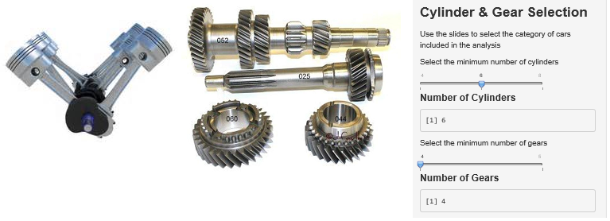
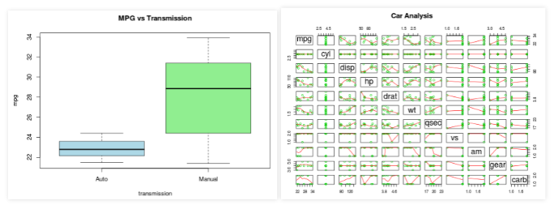

# Shiny Car Application


author: John Hoegger

date: 1/24/2015

Using Shiny Apps and the Motor Trend dataset

https://github.com/jhoegger/ShinyCar 

---
# About the Data

The shiny application was developed for analysis of the  
Motor Trends Car data set fromn 1973-74


```r
head(mtcars, 1)
```

```
##           mpg cyl disp  hp drat   wt  qsec vs am gear carb
## Mazda RX4  21   6  160 110  3.9 2.62 16.46  0  1    4    4
```

The dataset contains data for 32 different cars

---
# About the App

The app is published to the shinyapps site:

https://jhoegger.shinyapps.io/ShinyCar/

It allows the user to select the following options 
- Minimum Number of Cylinders (4, 6 or 8)
- Minimum Number of gears     (4 or 5)



---
# About the Analysis

The application compares auto and manual transmissions 
using a t-test to assess the impact on Mile per Gallon 

### Answering the questions of interest 

- H0 - Null Hypothesis - The different transmissions 
(auto and manual) do not impact miles per gallon
- Ha - Alternative Hypothesis - The difference in the 
transmission does have an impact on the miles per gallon

---
# About the Plots

The application also provides a to allow the user to see
the impact of changing the sliders for number of cylinders
and gears




